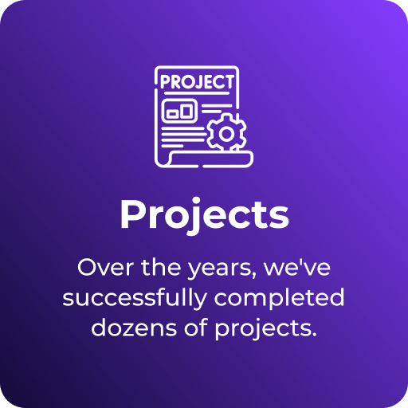
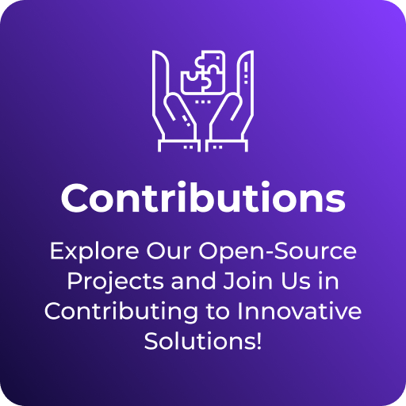

<!-- GitHub Profile -->

<!-- [](https://nuxters.nuxt.com/thetalentcoder) -->


<!--![Header] (./profileHeader.png) -->

<p align="center">
  <picture>
    <source media="(prefers-color-scheme: dark)" srcset="https://raw.githubusercontent.com/thetalentcoder/thetalentcoder/output-3d-contrib/night_southern.svg">
    <source media="(prefers-color-scheme: light)" srcset="https://raw.githubusercontent.com/thetalentcoder/thetalentcoder/output-3d-contrib/day_southern.svg">
    
  </picture>
</p>


<p align="center">
  
  
  
</p>


<p align="center">
  
  
</p>

<p align="center">
  
</p>


</br>

________________________________________________________


<p align="center">
<a href="https://tally.so/r/3lldZB" target="_blank"></a>
<a href="https://tally.so/r/3lldZB" target="_blank"></a>
<a href="https://tally.so/r/3j9Qza" target="_blank"></a>
</p>
<p align="center">
<a href="https://tally.so/r/3j9Qza" target="_blank"></a>
<a href="https://tally.so/r/3j9Qza" target="_blank"></a>
<a href="https://tally.so/r/3j9Qza" target="_blank"></a>
</p>
<p align="center">
<a href="https://tally.so/r/3j9Qza" target="_blank"></a>
<a href="https://tally.so/r/3j9Qza" target="_blank"></a>
<a href="https://tally.so/r/3j9Qza" target="_blank"></a>
</p>


</br>


________________________________________________________

</br>

<div align="center" style="margin: 20px 0;">
  <h1 style="font-size: 1.8rem; color: #2D88FF; margin-bottom: 10px;"><strong>My Skills</strong></h1>


   <h2>Programming Language</h2>
  
  
  
  
  
  
  

  </br></br>
  <h2>Backend</h2>
  
  
  
  
  
  
  
  
  
  
  
  
  


  </br></br>
  <h2 align="center">Frontend</h2>
  
  
  
  
  
  
  
  

  </br></br>
  <h2>Mobile Development</h2>
  
  
  
  
  
  
  

  </br></br>
  <h2>Geographic Information System(GIS)</h2>
  
  
  
  
  
  
  
  
  
  
  
  
  
  
  
  
  

  </br></br>
  <h2>Database Management</h2>
  
  
  
  
  
  
  
  

</div>
</br>


________________________________________________________


<h4 align="center">
  
```diff
+@ @ @ @ @ @ @ @ @ @ @ @ @ @ @ @ @ @ @ @ @ @ @ @ @ @ @ @+
@@       o o                                           @@
@@       | |                                           @@
@@      _L_L_                                          @@
@@   ❮\/__-__\/❯ Programming isn't about what you know @@
@@   ❮(|~o.o~|)❯  It's about what you can figure out   @@
@@   ❮/ \`-'/ \❯                                       @@
@@     _/`U'\_                                         @@
@@    ( .   . )     .----------------------------.     @@
@@   / /     \ \    | while( ! (succeed=try() ) ) |     @@
@@   \ |  ,  | /    '----------------------------'     @@
@@    \|=====|/                                        @@
@@     |_.^._|                                         @@
@@     | |"| |                                         @@
@@     ( ) ( )   Testing leads to failure              @@
@@     |_| |_|   and failure leads to understanding    @@
@@ _.-' _j L_ '-._                                     @@
@@(___.'     '.___)                                    @@
+@ @ @ @ @ @ @ @ @ @ @ @ @ @ @ @ @ @ @ @ @ @ @ @ @ @ @ @+
```

</h4>  


</br>


<p align="center">
  <strong>Thanks for visiting</strong>
  <br>
  
</p>

<p align="center"> 


<p align="center">
Tracking of visitors to this page commenced on April 1, 2025.
</p>


<p align="center">
  
  Connect With Me
  
</p>

  

  
<p align="center">
  <a href="mailto:benjamin.gray.dev@gmail.com">
    
  </a>
  &nbsp;&nbsp;&nbsp;&nbsp;
  <a href="https://discord.gg/DtqthxBa">
    
  </a>
  &nbsp;&nbsp;&nbsp;&nbsp;
  <a href="https://t.me/HealerDevOps">
    
  </a>
  &nbsp;&nbsp;&nbsp;&nbsp;
  <a href="https://join.skype.com/invite/cid.91cfa8150ee0720">
    
  </a>
</p>


